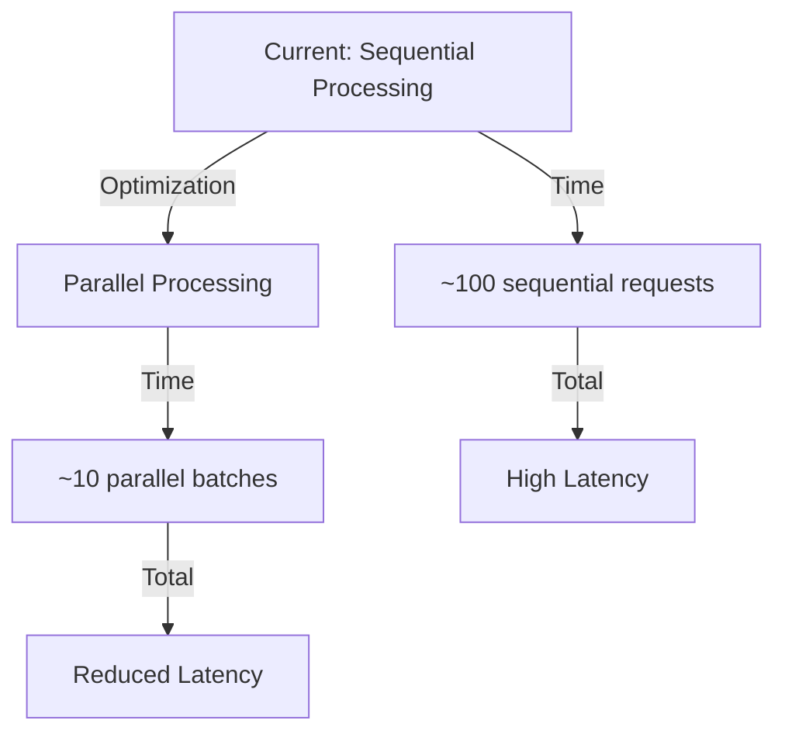

# Backfill Performance Optimization Plan

## Current Bottlenecks

After analyzing the codebase, I've identified several reasons why the initial backfill process for 100 transactions is taking a long time:

### 1. Sequential RPC Calls

- In `backfill_manager.rs` and `orca.rs`, each transaction is fetched one-by-one
- For each of the 100 signatures, there's a separate RPC call to `fetch_transaction()`
- Each call requires a full network round trip, accumulating significant latency

```rust
// Current implementation in orca.rs (lines ~185-243)
for sig in signatures {
    match backfill_manager.fetch_transaction(&sig).await {
        Ok(tx) => {
            // Process transaction...
        }
        Err(e) => {
            // Handle error...
        }
    }
}
```

### 2. Solana RPC Limitations

- Public RPC endpoints often have rate limits and throttling
- Full transaction fetching (`get_transaction_with_config`) is a heavyweight operation
- The JsonParsed encoding requested adds additional processing on the RPC side

### 3. No Parallelization

- The backfill process processes each transaction sequentially
- No concurrency is used for either fetching or processing transactions

### 4. Individual Database Operations

- Each event is inserted into the database immediately after processing
- No batching of database operations occurs

## Recommended Solutions

### 1. Implement Concurrent Transaction Fetching

Use tokio's concurrency features to fetch multiple transactions in parallel:

```rust
// Improved implementation with concurrency
let mut fetch_tasks = Vec::new();
for sig in &signatures {
    let sig_clone = sig.clone();
    let backfill_manager_clone = Arc::clone(&backfill_manager);

    // Spawn a task for each transaction fetch
    let task = tokio::spawn(async move {
        (sig_clone, backfill_manager_clone.fetch_transaction(&sig_clone).await)
    });
    fetch_tasks.push(task);
}

// Set a reasonable concurrency limit to avoid overwhelming the RPC provider
const MAX_CONCURRENT_REQUESTS: usize = 10;
let results = futures::future::join_all(fetch_tasks)
    .buffer_unordered(MAX_CONCURRENT_REQUESTS)
    .collect::<Vec<_>>()
    .await;

// Process the results
for result in results {
    if let Ok((sig, Ok(tx))) = result {
        // Process the transaction...
    }
}
```

### 2. Batch Database Operations

Collect events in memory and perform bulk inserts to reduce database round trips:

```rust
// Collect events before database insertion
let mut traded_events = Vec::new();
let mut liquidity_increased_events = Vec::new();
let mut liquidity_decreased_events = Vec::new();

// Collect events during processing
for result in results {
    if let Ok((sig, Ok(tx))) = result {
        if let Some(event) = process_transaction(&tx) {
            match event.event_type {
                OrcaWhirlpoolEventType::Traded => traded_events.push(event),
                OrcaWhirlpoolEventType::LiquidityIncreased => liquidity_increased_events.push(event),
                OrcaWhirlpoolEventType::LiquidityDecreased => liquidity_decreased_events.push(event),
            }
        }
    }
}

// Batch insert events
if !traded_events.isEmpty() {
    self.repository.batch_insert_traded_events(traded_events).await?;
}
// Same for other event types...
```

### 3. Progressive Backfill Strategy

Implement a tiered approach to backfilling:

```rust
// Tiered backfill approach
async fn tiered_backfill(&self, pool: &Pubkey) -> Result<()> {
    // First tier: Quick recent transactions (e.g., last 20)
    let recent_sigs = self.fetch_signatures(pool, 20).await?;
    self.process_signatures(recent_sigs).await?;

    // Second tier: More historical data in background
    tokio::spawn(async move {
        let historical_sigs = self.fetch_signatures_with_before(
            pool,
            100,
            recent_sigs.last().map(|s| s.to_string())
        ).await?;
        self.process_signatures(historical_sigs).await?;

        Ok(())
    });

    Ok(())
}
```

### 4. Optimize RPC Usage

Consider these improvements for RPC efficiency:

1. Use more optimized transaction encoding when possible
2. Consider fallback/multiple RPC providers
3. Implement exponential backoff for retries
4. Add RPC performance metrics to identify bottlenecks

```rust
// Optimized RPC config
let config = RpcTransactionConfig {
    encoding: Some(UiTransactionEncoding::Base64), // Less processing than JsonParsed
    commitment: Some(CommitmentConfig::confirmed()),
    max_supported_transaction_version: Some(0),
};
```

## Implementation Plan

1. **Phase 1**: Implement concurrent transaction fetching

   - Update BackfillManager to support batched operations
   - Add concurrency limits to avoid RPC throttling

2. **Phase 2**: Add database batching

   - Modify repositories to support bulk inserts
   - Implement event collection and batch processing

3. **Phase 3**: Progressive backfill strategy

   - Add tiered backfill option
   - Implement background processing for historical data

4. **Phase 4**: RPC optimizations
   - Add fallback RPC providers
   - Implement adaptive rate limiting

## Estimated Impact

- **Time Reduction**: Expected 60-80% reduction in backfill time
- **Resource Usage**: More efficient use of RPC quota
- **User Experience**: Faster initial data load with progressive updates


